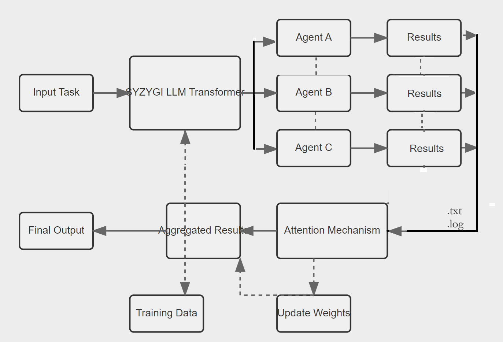

# SYZYGI

Syzygi is a cutting-edge framework for orchestrating role-playing, autonomous AI agents. Built on top of CrewAI, Syzygi fosters collaborative intelligence, empowering agents to work together seamlessly and tackle complex tasks.

### [Homepage]
AI HIVE (https://www.ai-hive.net/syzygi)

### contact: 
info@ai-hive.net

### Introduction
As AI foundation models advance, they are approaching PhD-level reasoning and logic abilities. While AI doctors, lawyers, and engineers aren't ready to practice independently, every professional will want a specialized AI partner to assist them in delivering premium service to their clients.

### The Problem
AI agent teams partnering with professionals face poor coordination, limited adaptability, and inconsistent performance. Trust issues and integration hurdles hinder adoption. AI needs better collaboration mechanisms, adaptive learning, and robust feedback loops to improve.

### The Solution
Syzygi is an AI Agent Team Architecture that mimics features of the neural net Transformer Architecture used to train LLMs. It provides power and flexibility for AI agents to synchronize their tasks on one project and train as a team over many projects.

## Syzygi - AI Agent Team Architecture

Syzygi presents a novel architecture that synergizes the strengths of specialized AI agents with powerful mechanisms found in transformer models. It is centered around a large language model (LLM) acting as a neural transformer, enhancing collaborative problem-solving, adaptability, and scalability in AI systems.

# Diagram



# How Syzygi Extends CrewAI
Syzygi builds upon CrewAI's foundation to create a more sophisticated and adaptable AI agent collaboration system:

### Neural Transformer:
Implements a central LLM to coordinate and integrate agent outputs, inspired by transformer architectures.
Adaptive Prompting: Dynamically generates prompts for agents based on task context, enhancing flexibility and performance.
Task Decomposition: Introduces a module for breaking down complex problems into manageable subtasks, improving efficiency and parallelization.

### Transformer-Inspired Mechanisms: 
Adapts concepts like attention mechanisms for task-agent relevance scoring and dynamic agent prioritization.
Enhanced Feedback Loops: Implements multi-layered feedback systems including inter-agent, central LLM to agent, and user to system feedback for continuous improvement.

### Weight Parameter System: 
Dynamically adjusts the influence of different components, balancing stability and adaptability.
Scalability: Designed with production environments in mind, allowing for easier scaling and integration with existing systems.

### Flexible Process Management: 
While building on CrewAI's sequential and hierarchical processes, Syzygi aims to introduce more complex processes like consensual and autonomous in future iterations.

# Key Features

### Role-Based Agent Design: 
Customize agents with specific roles, goals, and tools.

### Autonomous Inter-Agent Delegation: 
Agents can autonomously delegate tasks and inquire amongst themselves.

### Flexible Task Management: 
Define tasks with customizable tools and assign them to agents dynamically.

### Processes Driven: 
Supports sequential task execution and hierarchical processes.

### Output Handling: 
Save outputs as files or parse them as Pydantic models or JSON.

### Open Source Model Compatibility: 
Works with both proprietary (e.g., OpenAI) and open-source models.

# Installation

## Getting Started
To get started follow these simple steps:

### 1. Installation
```
pip install crewai
```
```
pip install 'crewai[tools]'
```
### 2. Setting Up Your Crew
``` 
pip install -r requirements.txt
```
### add new file 
```
app.py
```
### add file 
```
streamlit_app.py
```
### Run
``` 
streamlit run streamlit_app.py
``` 
## Project Structure
### app.py: 
Core logic for running AI crews and postmortem analysis

### streamlit_app.py: 
Streamlit-based user interface

### requirements.txt: 
Project dependencies

### How Syzygi Extends CrewAI
Syzygi builds upon CrewAI's foundation to create a more sophisticated and adaptable AI agent collaboration system:

## Project Structure under development
### Neural Transformer: 
Implements a central LLM to coordinate and integrate agent outputs, inspired by transformer architectures.
Adaptive Prompting: Dynamically generates prompts for agents based on task context, enhancing flexibility and performance.

### Task Decomposition: 
Introduces a module for breaking down complex problems into manageable subtasks, improving efficiency and parallelization.

### Transformer-Inspired Mechanisms: 
Adapts concepts like attention mechanisms for task-agent relevance scoring and dynamic agent prioritization.

### Enhanced Feedback Loops: 
Implements multi-layered feedback systems including inter-agent, central LLM to agent, and user to system feedback for continuous improvement.

### Weight Parameter System: 
Dynamically adjusts the influence of different components, balancing stability and adaptability.
Scalability: Designed with production environments in mind, allowing for easier scaling and integration with existing systems.

### Flexible Process Management: 
While building on CrewAI's sequential and hierarchical processes, Syzygi aims to introduce more complex processes like consensual and autonomous in future iterations.

## License
This project is licensed under the MIT License. See the LICENSE file for details.