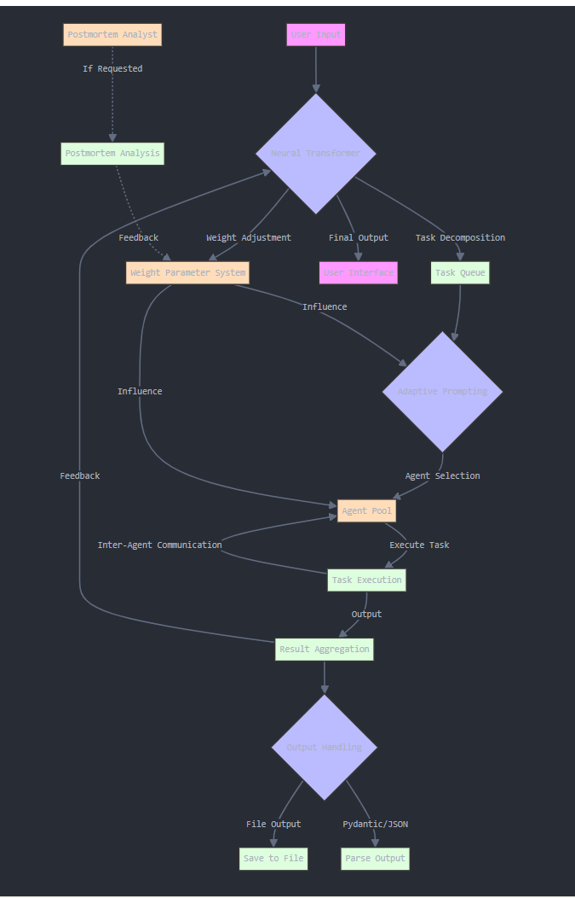

# SYZYGI AI Analysis

SYZYGI is a self-improvement framework for orchestrating role-playing, autonomous AI agents. Built on top of CrewAI, SYZYGI fosters collaborative intelligence, empowering agents to work together seamlessly and tackle complex tasks.

## Table of Contents
1. [Introduction](#introduction)
2. [Features](#features)
3. [Installation](#installation)
4. [Usage](#usage)
5. [Project Structure](#project-structure)
6. [Postmortem Analysis](#postmortem-analysis)
7. [Future Enhancements](#future-enhancements)
8. [Contributing](#contributing)
9. [License](#license)
10. [Contact](#contact)

## Introduction

As AI foundation models advance, they are approaching PhD-level reasoning and logic abilities. While AI doctors, lawyers, and engineers aren't ready to practice independently, every professional will want a specialized AI partner to assist them in delivering premium service to their clients.

SYZYGI addresses the challenges of poor coordination, limited adaptability, and inconsistent performance in AI agent teams. It provides power and flexibility for AI agents to synchronize their tasks on one project and train as a team over many projects.

## Features

- **Role-Based Agent Design:** Customize agents with specific roles, goals, and tools.
- **Autonomous Inter-Agent Delegation:** Agents can autonomously delegate tasks and inquire amongst themselves.
- **Flexible Task Management:** Define tasks with customizable tools and assign them to agents dynamically.
- **Processes Driven:** Supports sequential task execution and hierarchical processes.
- **Output Handling:** Save outputs as files or parse them as Pydantic models or JSON.
- **Open Source Model Compatibility:** Works with both proprietary (e.g., OpenAI) and open-source models.
- **Postmortem Analysis:** Comprehensive evaluation of team performance after each analysis task.

## Installation

1. Clone the repository:
   ```
   git clone https://github.com/yourusername/test1.git
   cd syzygi
   ```

2. Create and activate a virtual environment:
   ```
   conda create -n test1 python=3.11
   cd test1
   conda activate test1

   ```

3. Install the required packages:
   ```
   pip install -r requirements.txt
   ```

4. Set up your environment variables:
   Create a `.env` file in the project root and add your API keys:
   ```
   OPENAI_API_KEY=your_openai_api_key
   SERPER_API_KEY=your_serper_api_key
   ```

## Usage

Run the Streamlit app:
```
streamlit run streamlit_app.py
```

Follow the prompts in the web interface to conduct AI analyses and postmortem evaluations.

## Project Structure

- `app.py`: Core logic for running AI crews and postmortem analysis
- `streamlit_app.py`: Streamlit-based user interface
- `postmortem_data_processor.py`: Handles postmortem data collection and preprocessing
- `requirements.txt`: Project dependencies

## Postmortem Analysis

The postmortem analysis feature provides a comprehensive evaluation of the AI crew's performance after completing an analysis task. This feature helps identify strengths, areas for improvement, and generates actionable recommendations for future tasks.

### Key Components:

1. **Postmortem Execution (`app.py`):**
   - The `run_postmortem` function orchestrates the postmortem analysis.
   - Uses a dedicated 'Postmortem Analyst' agent to evaluate the team's performance.
   - Processes the analysis results and structures the output for easy interpretation.

2. **Data Processing (`postmortem_data_processor.py`):**
   - Handles the collection and preprocessing of postmortem data.
   - Prepares the data for potential future machine learning analysis.

3. **Output Structure:**
   - Results are structured into sections such as "What Went Well", "What Could Be Improved", and "Specific Recommendations".
   - Saved in both text and JSON formats for flexibility in further processing or display.

4. **User Interface (`streamlit_app.py`):**
   - Provides an interactive interface for users to initiate and view postmortem analyses.
   - Displays the structured postmortem results in a readable format.
   - Offers a download option for the full postmortem results as a JSON file.

# Diagram



## Future Enhancements

- Implementation of a neural transformer for better agent coordination.
- Development of a weight parameter system for dynamic adjustment of component influence.
- Expansion of process management to include consensual and autonomous processes.
- Integration of more advanced feedback loops for continuous improvement.
- Implementation of a plugin system to allow for easy extension of agent capabilities.
- Addition of visualization components to help users understand the analysis process and results.
- Integration of machine learning models for automated performance evaluation in postmortems.
- Trend analysis across multiple postmortems to identify patterns in team performance over time.

## Contributing

Contributions are welcome! Please feel free to submit a Pull Request.

## License

This project is licensed under the MIT License. See the [LICENSE](LICENSE) file for details.

## Contact

- **Homepage:** [AI HIVE](https://www.ai-hive.net/syzygi)
- **Email:** info@ai-hive.net

For any questions or feedback, please open an issue in the GitHub repository or contact us via email.