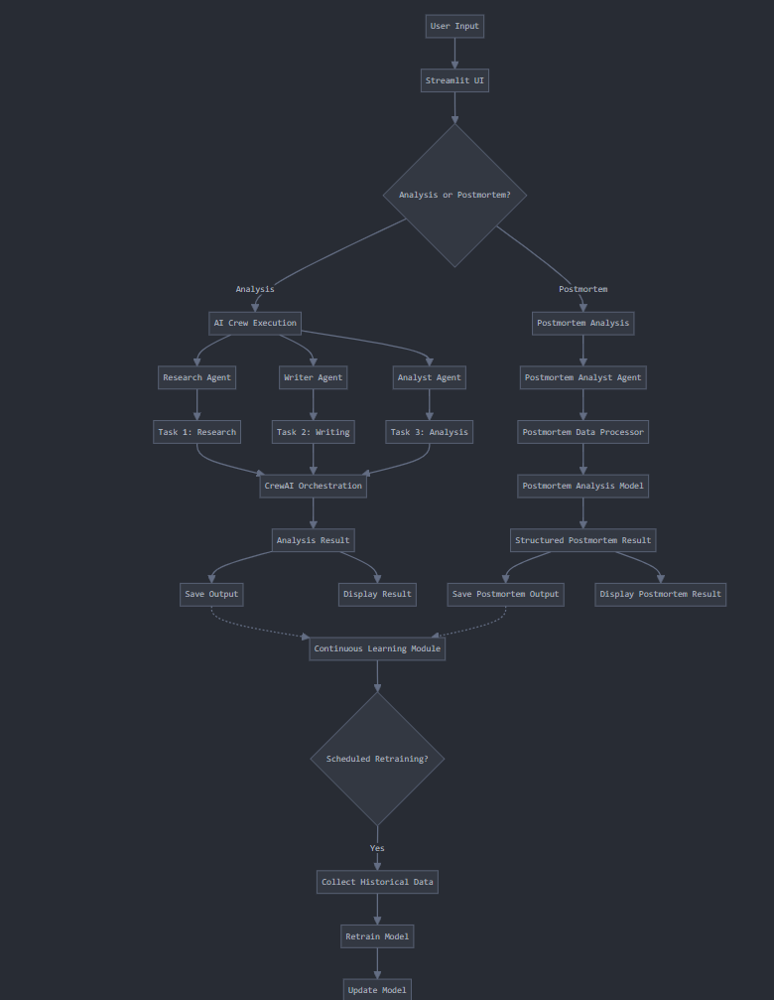
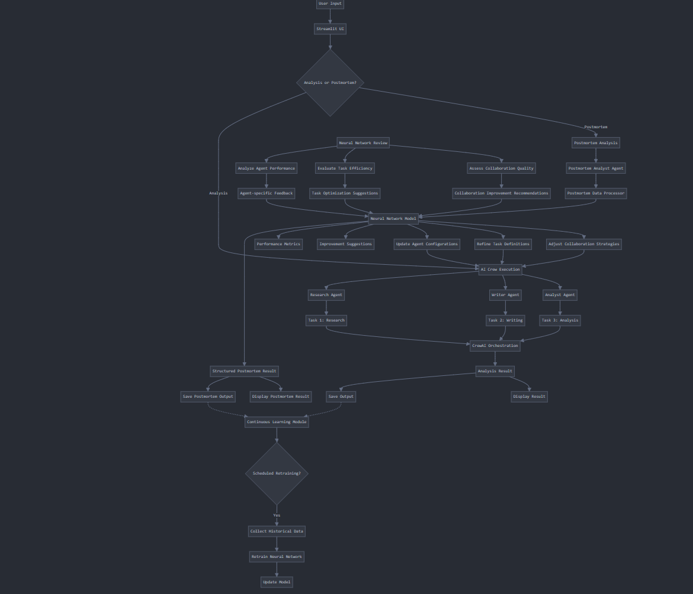

# SYZYGI: AI Agent Orchestration Framework

SYZYGI is an advanced self-improvement framework for orchestrating role-playing, autonomous AI agents. Built on top of CrewAI, SYZYGI fosters collaborative intelligence, empowering agents to work together seamlessly and tackle complex tasks.

## Table of Contents
1. [Introduction](#introduction)
2. [Key Features](#key-features)
3. [Architecture](#architecture)
4. [Installation](#installation)
5. [Usage](#usage)
6. [Project Structure](#project-structure)
7. [Postmortem Analysis](#postmortem-analysis)
8. [Continuous Learning](#continuous-learning)
9. [Future Enhancements](#future-enhancements)
10. [Contributing](#contributing)
11. [License](#license)
12. [Contact](#contact)

## Introduction

As AI foundation models advance, they are approaching PhD-level reasoning and logic abilities. While AI doctors, lawyers, and engineers aren't ready to practice independently, every professional will want a specialized AI partner to assist them in delivering premium service to their clients.

SYZYGI addresses the challenges of poor coordination, limited adaptability, and inconsistent performance in AI agent teams. It provides power and flexibility for AI agents to synchronize their tasks on one project and train as a team over many projects.

## Key Features

- **Role-Based Agent Design:** Customize agents with specific roles, goals, and tools.
- **Autonomous Inter-Agent Delegation:** Agents can autonomously delegate tasks and inquire amongst themselves.
- **Flexible Task Management:** Define tasks with customizable tools and assign them to agents dynamically.
- **Processes Driven:** Supports sequential task execution and hierarchical processes.
- **Output Handling:** Save outputs as files or parse them as Pydantic models or JSON.
- **Open Source Model Compatibility:** Works with both proprietary (e.g., OpenAI) and open-source models.
- **Postmortem Analysis:** Comprehensive evaluation of team performance after each analysis task.
- **Continuous Learning:** Scheduled model retraining for long-term improvement.

## Architecture

SYZYGI uses a modular architecture with separate components for different functionalities:

1. **Core Logic (app.py):** Manages AI crews and orchestrates the main workflow.
2. **User Interface (streamlit_app.py):** Provides an intuitive Streamlit-based interface for user interactions.
3. **Postmortem Analysis:**
   - Data Processing (postmortem_data_processor.py)
   - Machine Learning Model (postmortem_analysis_model.py)
4. **Continuous Learning (continuous_learning_module.py):** Handles scheduled model retraining.

The project leverages CrewAI for agent orchestration and extends it with custom postmortem analysis and continuous learning capabilities.

## Installation

1. Clone the repository:
   ```
   git clone https://github.com/alessoh/syzygi.git
   cd syzygi
   ```

2. Create and activate a virtual environment:
   ```
   conda create -n syzygi python=3.11
   conda activate syzygi
   ```

3. Install the required packages:
   ```
   pip install -r requirements.txt
   ```

4. Set up your environment variables:
   Create a `.env` file in the project root and add your API keys:
   ```
   OPENAI_API_KEY=your_openai_api_key
   SERPER_API_KEY=your_serper_api_key
   ```

## Usage

Run the Streamlit app:
```
streamlit run streamlit_app.py
```

Follow the prompts in the web interface to conduct AI analyses and postmortem evaluations.

## Project Structure

- `app.py`: Core logic for running AI crews and postmortem analysis
- `streamlit_app.py`: Streamlit-based user interface
- `postmortem_data_processor.py`: Handles postmortem data collection and preprocessing
- `postmortem_analysis_model.py`: Defines the neural network model for postmortem analysis
- `continuous_learning_module.py`: Implements continuous model retraining
- `requirements.txt`: Project dependencies

## Postmortem Analysis

The postmortem analysis feature provides a comprehensive evaluation of the AI crew's performance after completing an analysis task. This feature helps identify strengths, areas for improvement, and generates actionable recommendations for future tasks.

### Key Components:

1. **Postmortem Execution (`app.py`):**
   - Orchestrates the postmortem analysis using a dedicated 'Postmortem Analyst' agent.
   - Processes and structures the analysis results for easy interpretation.

2. **Data Processing (`postmortem_data_processor.py`):**
   - Collects and preprocesses postmortem data for potential machine learning analysis.

3. **Machine Learning Model (`postmortem_analysis_model.py`):**
   - Defines a neural network for advanced postmortem analysis (integration pending).

4. **Output Structure:**
   - Results are structured into sections such as "What Went Well", "What Could Be Improved", and "Specific Recommendations".
   - Saved in both text and JSON formats for flexibility in further processing or display.

   # Diagram of current logic



## Continuous Learning

SYZYGI implements a continuous learning module to improve its performance over time:

- Scheduled model retraining based on accumulated postmortem data.
- Utilizes the `ContinuousLearningModule` class for managing the retraining process.
- Allows for dynamic adjustment of the AI agents' behavior based on past performance.

## Future Enhancements

- Implementation of a neural transformer for better agent coordination.
- Development of a weight parameter system for dynamic adjustment of component influence.
- Expansion of process management to include consensual and autonomous processes.
- Integration of more advanced feedback loops for continuous improvement.
- Implementation of a plugin system to allow for easy extension of agent capabilities.
- Addition of visualization components to help users understand the analysis process and results.
- Full integration of the machine learning model for automated performance evaluation in postmortems.
- Trend analysis across multiple postmortems to identify patterns in team performance over time.
- Comprehensive test suite for ensuring reliability and easier maintenance.
- Enhanced error handling and logging system for better debugging and monitoring.
- Configuration file for easily adjustable parameters (e.g., model hyperparameters, scheduling intervals).
- Improved API documentation with detailed docstrings for all functions and classes.

   # Diagram of neural net logic under development



## Contributing

Contributions are welcome! Please feel free to submit a Pull Request. Here are some areas where contributions would be particularly valuable:

- Implementing any of the future enhancements listed above.
- Improving test coverage and documentation.
- Optimizing performance of existing components.
- Adding new features or integrations that align with SYZYGI's goals.

## License

This project is licensed under the MIT License. See the [LICENSE](LICENSE) file for details.

## Contact

- **Homepage:** [AI HIVE](https://www.ai-hive.net/syzygi)
- **Email:** info@ai-hive.net

For any questions, feedback, or bug reports, please open an issue in the GitHub repository or contact us via email.